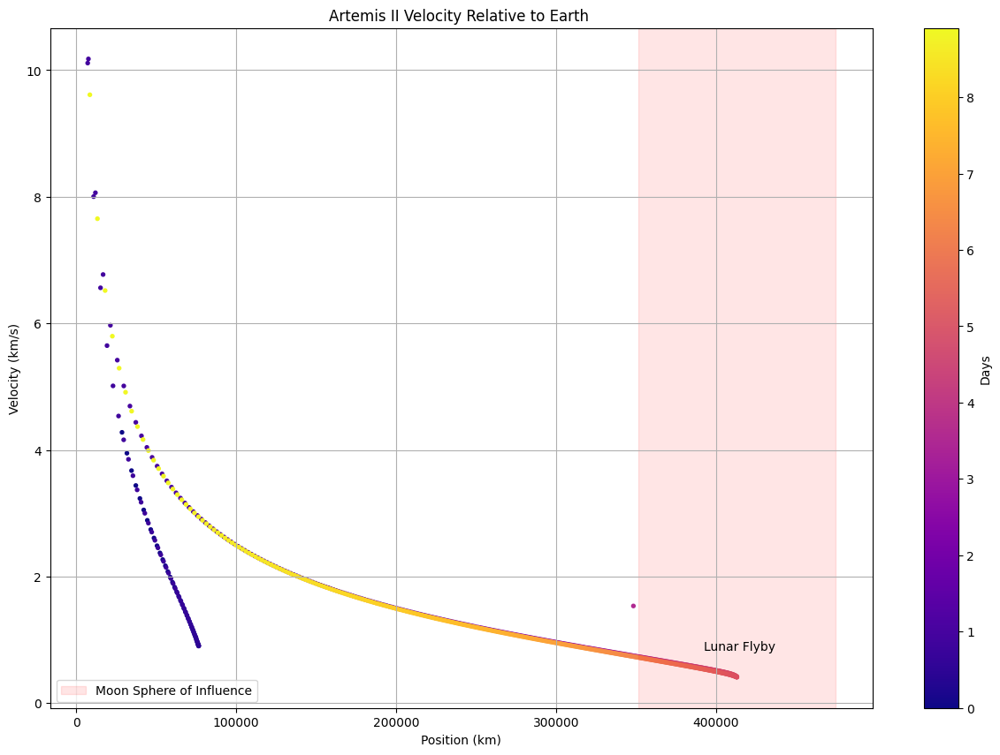

# \# Artemis II Trajectory Visualization

# 

# \## Overview

# 

# This project visualizes the trajectory of NASA's Artemis II mission using Python.

# 

# The project includes:

# 

# \- Trajectory visualization

# \- Animated spacecraft motion

# \- Velocity-position analysis

# \- Scientific data visualization

# 

# \---

# 

# \## Example Results

# 

# \### Velocity vs Position

# 

# 

# 

# \### Animation

# 

# !\[Trajectory](figures/art_animation.gif)

# 

# \### MP4 Version

# 

# \[Download MP4 Animation](figures/art_animation.mp4)

